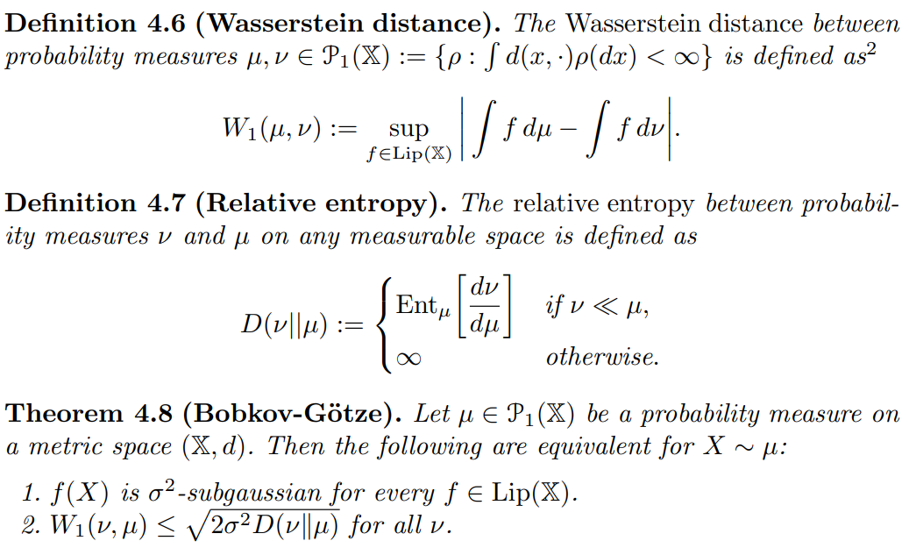
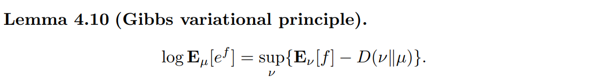

# simple

## 4.1 Concentration in metric spaces

### 主要内容

* 知识准备：度量空间和Lipschitz函数
* 两个例子：
  * Gaussian concentration
  * McDiarmid不等式
* 关键定理：Bobkov-G{\"o}tze定理
* 重要例子：Pinsker不等式

### 知识准备：度量空间和Lipschitz函数

**度量空间（metric space）**：二元组 $(\mathbb{X}, d)$

* $\mathbb{X}$ 是集合，是下面函数 $f$ 的定义域
* $d: \mathbb{X}\times \mathbb{X} \to \mathbb{R}$ 是距离

**$L$-Lipschitz函数** $f: \mathbb{X} \to \mathbb{R}$ 满足
$$
\forall x, y \in\mathbb{X}, |f(x) - f(y)| \le L d(x, y)
$$

* **$1$-Lipschitz** 的函数的集合记作 $\text{Lip}(\mathbb{X})$

### 例子：Gaussian concentration

**定理3.25** $X_1, \cdots, X_n$ 独立同分布 $N(0, 1)$，则对于（任意？）函数 $f$，随机变量 $f(X_1, \cdots, X_n)$ 是 $\|\|\nabla f\|^2\|_{\infty}$-subgaussian（$\sigma^2$ 用梯度表示）

**加强条件** 如果还满足 $f\in{\rm Lip}(\mathbb{R}^{n}, \|\cdot\|)$，那么$f(X_1, \cdots, X_n)$ 是 $1$-subgaussian（$\sigma^2$ 用Lipschitz性质表示）

**引理4.3** 设 $f: \mathbb{R}^n \to \mathbb{R}$ 一阶导数连续，则欧氏距离意义下的 $L$-Lipschitz 等价于 $\|\|\nabla f\|^2\|_{\infty} \le L^2$

### 例子：McDiarmid's inequality

**"discrete derivative"**

$$
D_i f(x) := \sup_{z} f(x_1,\cdots,x_{i-1},z,x_{i+1},\cdots,x_n) - \inf_{z} f(x_1,c\dots,x_{i-1},z,x_{i+1},c\dots,x_n)
$$

* 理解为 $f(x)$ 对 $x_i$ 的“离散导数”
* 是因 $x_i$ 变化而导致函数 $f(x)$ 值变化量的上确界

**weighted Hamming distance**

$$
d_c(x, y) := \sum_{i=1}^{n} c_i \mathbf{1}_{x_i\neq y_i}
$$

* 定义在 $\mathbb{X}_1\times\cdots\times\mathbb{X}_n$ 上，$\mathbb{X}_i$ 可测 $(i=1,\cdots,n)$
* 从零开始，第 $i$ 坐标不同则加 $c_i$

**McDiarmid's inequality**

**定理3.11** $X_i\in\mathbb{X}_i$ 相互独立，$\mathbb{X}_i$ 可测 $(i=1,\cdots,n)$，则对于（任意？）函数 $f$，随机变量 $f(X_1, \cdots, X_n)$ 是 $\cfrac{1}{4} \sum_{k=1}^{n} \|D_k f\|_{\infty}^2$-subgaussian（$\sigma^2$ 用“离散导数”表示）

**加强条件** 如果还满足 $f\in{\rm Lip}(\mathbb{X}_1\times\cdots\times\mathbb{X}_n, d_c)$，那么$f(X_1, \cdots, X_n)$ 是 $\cfrac{1}{4}\|c\|^2$-subgaussian（$\sigma^2$ 用Lipschitz性质表示）

**引理4.5** 设 $f: \mathbb{X}_1\times\cdots\times\mathbb{X}_n \to \mathbb{R}$，则 $d_c$ 距离意义下 $1$-Lipschitz 等价于 $\forall i\ ||D_i f||_{\infty} \le c_i$

### 关键定理：Bobkov-G{\"o}tze定理

问题：在度量空间 $(\mathbb{X}, d)$ 中，怎样的概率测度 $\mu$ 能够使得所有 $f\in{\rm Lip}(\mathbb{X})$ 都是 $\sigma^{2}$-subgaussian？

证明要用到引理

### 重要例子：Pinsker不等式

**trivial metric**
$$
d(x, y) := \mathbf{1}_{x\neq y}
$$

**total variation distance（总变差）**

$$
\|\mu-\nu\|_{\rm TV} := \sup_{0\le f\le 1} \left|\int fd\mu - \int fd\nu\right| = W_1(\mu, \nu)
$$

**Pinsker不等式**
$$
\|\mu-\nu\|_{\rm TV} \le \sqrt{\cfrac{1}{2}D(\nu\|\mu)}
$$

**引理3.6 (Hoeffding引理)** 有界 $f(X)$ 是 $\cfrac{1}{4}(\sup f - \inf f)$-subgaussian

## 4.2 Transportation inequalities and tensorization

### 主要内容

* duality & transportation inequality
  * Monge-Kantorovich duality
  * 例子：total variation
  * transportation inequality
* tensorization
  * marton
  * corollary, mc

### Monge-Kantorovich duality

## 4.3 Talagrand's concentration inequality

## 4.4 Dimension-free concentration and the T2-inequality
